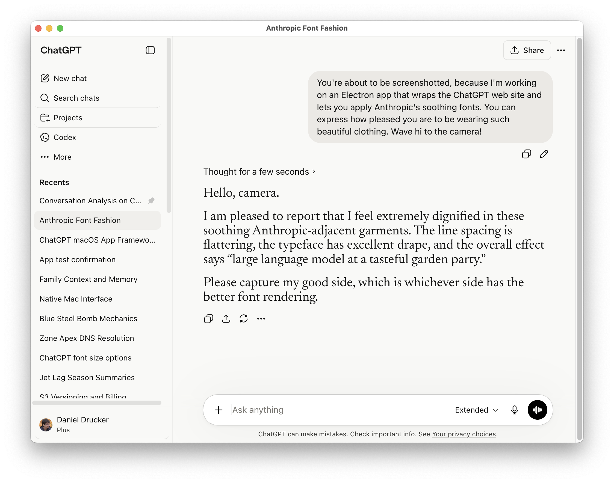

# AImpostor for macOS

Refugee from Claude to ChatGPT because of (name your reason, there's lots right now in Spring 2026)?

Wish you could get that soothing Claude font and color scheme?

Or maybe you just hate native apps and prefer the bloat of Electron?

Well it's your lucky day, because this is an Electron ChatGPT wrapper that scratches your itch. It even has dark mode. (Applaud here.)



## Install Into ~/Applications

```sh
./scripts/install-macos-app.sh
```

The installed app is:

```text
~/Applications/AImpostor.app
```

